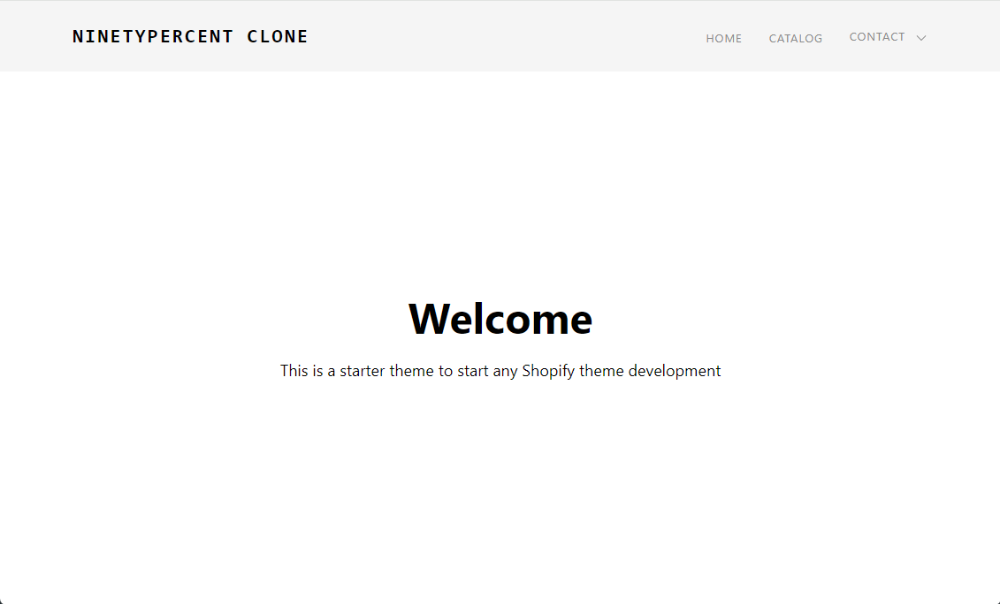

## Ninetypercent.com clone

This is a clone of a popular site ninetypercent.com



It contains all the necessary Shopify files and directories. It also supports Sass/SCSS and has build step for that.

To compile SCSS into regular CSS, run `npm run sass` from the root directory.

```
npm run sass
```

Also, to start the local development, you can run `shopify theme dev` or `npm run dev` from the root directory.

```
npm run dev

# or

shopify theme dev
```
